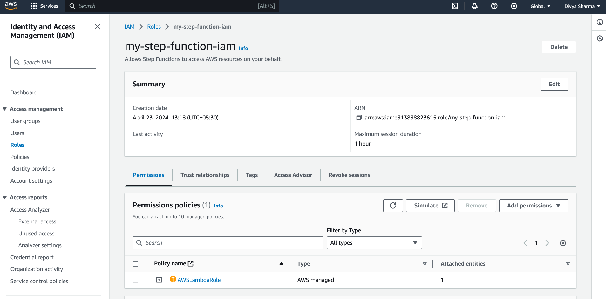
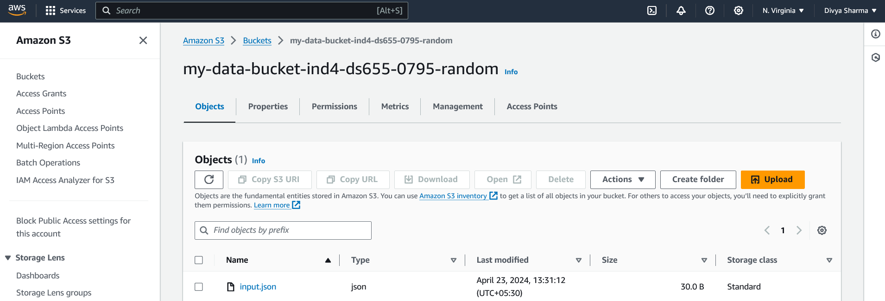
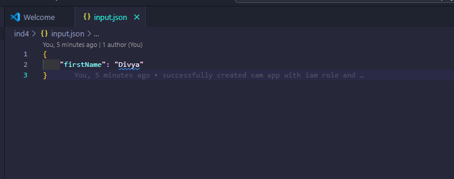
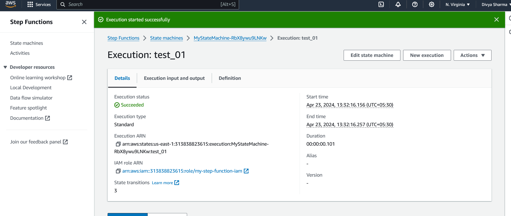
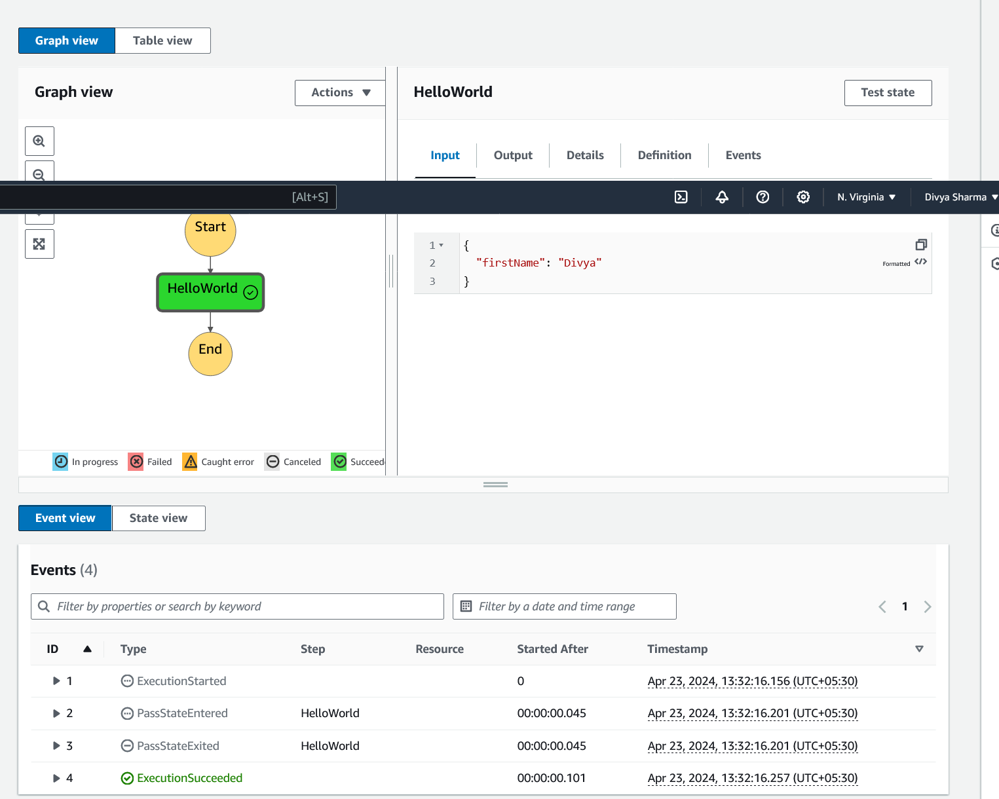

# DS655 IDS721 Individual Project 04 - Rust AWS Lambda and Step Functions

This project demonstrates the use of AWS Lambda and Step Functions to orchestrate a data processing pipeline. The Lambda function is written in Rust.

## Requirements

- Rust AWS Lambda function
- Step Functions workflow coordinating Lambdas
- Orchestrate data processing pipeline

## Project Structure

- `src/`: This directory contains the Rust source code for the AWS Lambda function.
- `template.yaml`: This file is an AWS SAM template that defines the AWS resources used by this project.
- `pipeline/`: This directory contains the definition of the AWS Step Functions state machine that orchestrates the data processing pipeline.

## Setup

1. Install the [AWS CLI](https://aws.amazon.com/cli/) and [AWS SAM CLI](https://docs.aws.amazon.com/serverless-application-model/latest/developerguide/serverless-sam-cli-install.html).
2. Run `sam build` to build the Lambda function.
3. Run `sam deploy --guided` to deploy the Lambda function and Step Functions state machine to AWS.

Successfully deployed Sam app:

## IAM Role Setup

1. Navigate to the IAM Management Console in AWS.
2. Click on "Roles" and find the `my-step-function-iam` role.
3. Check the permissions attached to the role and ensure it has the necessary permissions for your state machine.

## S3 Bucket Setup

1. Navigate to the S3 Management Console in AWS.
2. Find the bucket specified in the `template.yaml` file.
3. Upload your data to this bucket.

## Usage

1. Upload your data to the S3 bucket specified in the `template.yaml` file.
s3 Bucket: `my-data-bucket-ind4-ds655-0795-random`

Sample file:

2. Start the Step Functions state machine in the AWS Management Console. The state machine will read the data from S3, process it using the Lambda function, and write the results back to S3.

## Demo

A demo of this project is available [here](https://www.youtube.com/watch?v=dQw4w9Wg).

